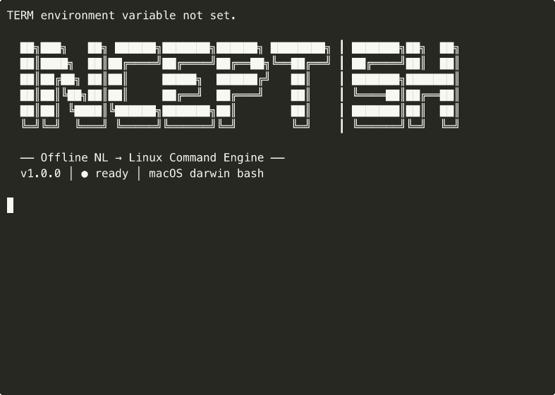

<div align="center">

```
██╗███╗   ██╗ ██████╗███████╗██████╗ ████████╗ ┃ ███████╗██╗  ██╗
██║████╗  ██║██╔════╝██╔════╝██╔══██╗╚══██╔══╝ ┃ ██╔════╝██║  ██║
██║██╔██╗ ██║██║     █████╗  ██████╔╝   ██║    ┃ ███████╗███████║
██║██║╚██╗██║██║     ██╔══╝  ██╔═══╝    ██║    ┃ ╚════██║██╔══██║
██║██║ ╚████║╚██████╗███████╗██║        ██║    ┃ ███████║██║  ██║
╚═╝╚═╝  ╚═══╝ ╚═════╝╚══════╝╚═╝        ╚═╝    ┃ ╚══════╝╚═╝  ╚═╝
```

**Offline Command Inference Engine for Linux**

[](https://www.python.org/downloads/)
[](https://huggingface.co/Qwen/Qwen3.5-0.8B)
[](LICENSE)

</div>

---

INCEPT.sh is a fine-tuned **Qwen3.5-0.8B** model (GGUF Q8_0, 774MB) that maps plain English descriptions to Linux shell commands. It runs entirely offline — no API calls, no network dependency, no cloud backend.

```bash
INCEPT.sh ❯ find all python files modified in the last 7 days
  ✓ SAFE   $ find . -name "*.py" -mtime -7

INCEPT.sh ❯ grep for email addresses in contacts.csv
  ✓ SAFE   $ grep -oE '[a-zA-Z0-9._%+-]+@[a-zA-Z0-9.-]+\.[a-zA-Z]{2,}' contacts.csv

INCEPT.sh ❯ show all open ports and which process is using them
  ✓ SAFE   $ sudo netstat -tulpn

INCEPT.sh ❯ append text at line 1000 of hello.txt
  ✓ SAFE   $ sed -i '1000a\ your text here' hello.txt
```

---



---

## Overview

INCEPT.sh is a locally-deployed inference engine for Linux command generation. The model was trained via supervised fine-tuning on 79,264 ChatML examples spanning Ubuntu, Debian, RHEL, Arch, Fedora, and CentOS.

**Key characteristics:**

- **~1–2 seconds** per query on Apple M4 (CPU inference via llama.cpp)
- **Greedy decoding** (temperature = 0.0) for deterministic, reproducible output
- **Post-processing safety layer** — suppresses prose, detects prompt injection, classifies command risk
- **Distro-aware context** — detects the host system and adjusts output accordingly

---

## Quick Start

### Requirements

- Python 3.11+
- [`llama-server`](https://github.com/ggerganov/llama.cpp) on `PATH`
- ~1GB available RAM

### Installation

```bash
git clone https://github.com/0-Time/INCEPT.sh
cd INCEPT.sh
python3 -m venv .venv
source .venv/bin/activate
pip install -e ".[cli]"
```

### Model

Place the GGUF model file in the `models/` directory:

```bash
mkdir -p models
cp incept-sh.gguf models/
```

```bash
huggingface-cli download 0Time/INCEPT.sh \
  incept-sh.gguf --local-dir ./models
```

### Usage

```bash
# Interactive CLI
incept

# Single query (non-interactive)
incept -c "list all running docker containers"

# Minimal output for scripting
incept -c "show disk usage" -m

# Generate and optionally execute
incept -c "show memory usage" --exec
```

---

## CLI Reference

```
incept [OPTIONS]

Options:
  -c, --command TEXT   Single query (non-interactive mode)
  -m, --minimal        Emit the command only, no formatting
  --exec               Prompt to execute the generated command
  --help               Show this message and exit
```

**Interactive CLI commands:**

| Command    | Description                      |
|------------|----------------------------------|
| `/help`    | List available commands          |
| `/context` | Display detected system context  |
| `/exit`    | Terminate the session            |

---

## Architecture

1. The query is passed to the fine-tuned model via `llama-server` (subprocess).
2. Output is post-processed: first line extracted, prose suppressed, injection attempts blocked.
3. A risk classifier labels each command: `SAFE` / `CAUTION` / `DANGEROUS` / `BLOCKED`.
4. The user is presented with the command and options to execute, copy, or dismiss.

The engine uses `llama-server` as its inference backend. `llama-cpp-python` is supported as an optional alternative but does not currently support the Qwen3.5 GGUF architecture natively.

---

## Safety

The post-processing layer enforces the following:

- **Prompt injection detection** — exact-phrase matching against known manipulation patterns; returns `UNSAFE_REQUEST` on match.
- **Prose suppression** — non-command English output is discarded.
- **Catastrophic pattern blocking** — hardcoded rejection of destructive patterns (fork bombs, `rm -rf /`, pipe-to-shell, etc.) regardless of model output.
- **Risk classification** — every command is labeled before display; `DANGEROUS` commands require explicit confirmation to execute.
- **No network calls** — zero outbound traffic at runtime.

---

## Training

Base model: [Qwen/Qwen3.5-0.8B](https://huggingface.co/Qwen/Qwen3.5-0.8B) (hybrid SSM/attention architecture).

| Parameter              | Value                                         |
|------------------------|-----------------------------------------------|
| Training method        | Supervised fine-tuning (LoRA)                 |
| Training examples      | 79,264 (SFT v2) + 11,306 (pipe refinement)   |
| LoRA rank              | 16                                            |
| Learning rate          | 5×10⁻⁵                                       |
| Quantization           | Q8_0 (774MB)                                  |
| Inference temperature  | 0.0 (greedy)                                  |
| Training hardware      | Apple M4 Mac mini, 32GB unified RAM           |
| Training duration      | ~12 hours (CPU, MPS partial)                  |


---

## Project Structure

```
incept/
├── cli/        # Entry point, banner, CLI, command execution
├── core/       # Inference engine, model loader, context detection
├── safety/     # Validator, risk classification, banned patterns
├── server/     # Optional FastAPI server (REST API mode)
├── training/   # SFT trainer, export, benchmark utilities
models/         # GGUF model files (not tracked in repository)
data/           # Training data (not tracked in repository)
tests/          # Test suite (2076 tests)
```

---

## Known Limitations

### Model Accuracy

INCEPT.sh uses a 0.8B parameter model optimized for size and speed. This comes with trade-offs:

- **Compound operations** — queries combining multiple actions (e.g. *"rename X to Y and move it to /home"*) may produce a partial command. The model may handle one operation and miss the other. Workaround: split into two queries.
- **Time unit ambiguity** — `find` queries using hours (e.g. *"files modified in the last 2 hours"*) may use `-mtime` (days) instead of `-mmin` (minutes). Be explicit: *"files modified in the last 120 minutes"*.
- **Uncommon tools** — queries for niche or distro-specific utilities may produce a generic alternative or no result.
- **Disk usage vs filesystem usage** — *"disk usage sorted by size"* may return `df` instead of `du`. Prefer specific phrasing: *"directory sizes sorted by size"*.

These are model-level limitations. The post-processing layer ensures that malformed or hallucinated output is blocked and returns `# Could not generate command` instead of executing garbage.

### Technical

- `llama-cpp-python` does not support Qwen3.5 GGUF natively; the engine falls back to `llama-server` automatically.
- First install requires building `llama-server` from source (~10 minutes on aarch64).
- Mamba (SSM) layers have no Metal (MPS) kernel; training runs on CPU.

---

## License

[Apache License 2.0](LICENSE)

---

<div align="center">
INCEPT.sh
</div>
