# Architecture

This document provides visual architecture diagrams for INCEPT's major subsystems.

## Full Component Map

Every module in the `incept/` package and how they connect. Arrows show import/dependency direction (A → B means A imports from B).

```mermaid
flowchart TB
    subgraph CLI["cli/"]
        CLI_MAIN["main.py<br>Click entry point"]
        CLI_REPL["repl.py<br>Interactive REPL loop"]
        CLI_CMDS["commands.py<br>Slash command registry"]
        CLI_ACTIONS["actions.py<br>Command execution"]
        CLI_DISPLAY["display.py<br>Rich output formatting"]
        CLI_CONFIG["config.py<br>User preferences"]
        CLI_COMPLETER["completer.py<br>Tab completion"]
        CLI_CLIPBOARD["clipboard.py<br>Copy to clipboard"]
        CLI_PLUGIN["shell_plugin.py<br>Bash/Zsh installer"]
    end

    subgraph CORE["core/"]
        PIPELINE["pipeline.py<br>run_pipeline() orchestrator"]
        PRECLASSIFIER["preclassifier.py<br>Regex + keyword NLU"]
        MODEL_CLF["model_classifier.py<br>GGUF model inference"]
        DECOMPOSER["decomposer.py<br>Multi-step splitter"]
        CONTEXT["context.py<br>EnvironmentContext<br>distro detection"]
    end

    subgraph COMPILER["compiler/"]
        ROUTER["router.py<br>IntentRouter dispatch"]
        FILE_OPS["file_ops.py<br>12 file intents"]
        TEXT_OPS["text_ops.py<br>6 text intents"]
        SYSTEM_OPS["system_ops.py<br>27 system intents"]
        EXPANDED_OPS["expanded_ops.py<br>33 expanded intents"]
        FLAGS["flags.py<br>Version-aware flag tables"]
        QUOTING["quoting.py<br>Shell quoting"]
        COMPOSITION["composition.py<br>Pipe & chain commands"]
    end

    subgraph EXPLAIN["explain/"]
        EXPLAIN_PIPE["pipeline.py<br>run_explain_pipeline()"]
        PARSERS["parsers.py<br>17 inverse parsers"]
        REGISTRY["registry.py<br>Parser dispatch"]
    end

    subgraph SCHEMAS["schemas/"]
        INTENTS["intents.py<br>78 IntentLabel enum"]
        IR["ir.py<br>Pydantic IR models<br>SingleIR, PipelineIR"]
        PARAMS["params/<br>13 param models<br>(file, text, pkg, svc, etc.)"]
    end

    subgraph SAFETY["safety/"]
        VALIDATOR["validator.py<br>validate_command()<br>22 banned patterns<br>risk classification"]
    end

    subgraph SERVER["server/"]
        APP["app.py<br>FastAPI create_app()"]
        STATE["state.py<br>AppState singleton"]
        SRV_CONFIG["config.py<br>ServerConfig"]
        MODELS_SRV["models.py<br>Request/Response"]

        subgraph MW["middleware/"]
            SEC_HEADERS["security_headers.py<br>7 headers"]
            REQ_ID["request_id.py<br>X-Request-ID"]
            TIMEOUT["timeout.py<br>30s limit"]
            RATE_LIMIT["rate_limit.py<br>Per-IP token bucket"]
            AUTH["auth.py<br>Bearer API key"]
        end

        subgraph ROUTES["routes/"]
            R_CMD["command.py"]
            R_EXPLAIN["explain.py"]
            R_HEALTH["health.py"]
            R_FEEDBACK["feedback.py"]
            R_INTENTS["intents.py"]
            R_METRICS["metrics.py"]
        end
    end

    subgraph SESSION["session/"]
        SESS_STORE["store.py<br>SessionStore<br>max 1000 sessions"]
        SESS_MODELS["models.py<br>Session data model"]
        SESS_RESOLVER["resolver.py<br>Pronoun resolution"]
    end

    subgraph RECOVERY["recovery/"]
        REC_ENGINE["engine.py<br>RecoveryEngine"]
        REC_PATTERNS["patterns.py<br>7 error classifiers"]
    end

    subgraph RETRIEVAL["retrieval/"]
        BM25["bm25.py<br>BM25 text search"]
        DISTRO_MAPS["distro_maps.py<br>PACKAGE_MAP<br>SERVICE_MAP<br>PATH_DEFAULTS<br>5 distro families"]
    end

    subgraph TELEMETRY["telemetry/"]
        TEL_STORE["store.py<br>SQLite DB<br>table whitelist"]
        TEL_ANON["anonymizer.py<br>PII removal"]
        TEL_EXPORT["exporter.py<br>CSV/JSON export"]
    end

    subgraph TEMPLATES["templates/"]
        FORMATTER["formatter.py<br>Response templates"]
        EXPLANATIONS["explanations.py<br>Intent → NL map"]
    end

    subgraph CONFIDENCE["confidence/"]
        SCORING["scoring.py<br>ConfidenceScore"]
    end

    subgraph GRAMMARS["grammars/"]
        GBNF["*.gbnf files<br>Constrained decoding"]
    end

    subgraph TRAINING["training/"]
        TRAIN_PIPE["data_pipeline.py"]
        SFT["sft_trainer.py"]
        DPO["dpo_trainer.py"]
        BENCH["benchmark.py"]
        EXPORT["export.py"]
        ADV_TRAIN["adversarial.py"]
        TRAIN_CFG["config.py"]
    end

    subgraph DATA["data/"]
        GENERATOR["generator.py<br>Template expander"]
        SLOT_POOLS["slot_pools.py<br>Slot value pools"]
        DATA_TEMPLATES["templates.py<br>NL templates"]
        PARAPHRASER["paraphraser.py"]
        ASSEMBLER["assembler.py<br>Dedup + split"]
        CONVERTER["converter.py<br>Format conversion"]
        ADVERSARIAL["adversarial.py"]
        FORUM["forum_miner.py"]
    end

    subgraph EVAL["eval/"]
        EVAL_METRICS["metrics.py"]
        EVAL_REPORT["report.py"]
        EVAL_INTENT["intent_eval.py"]
        EVAL_SLOT["slot_eval.py"]
        EVAL_LOADER["loader.py"]
    end

    subgraph SCRIPTS["scripts/plugins/"]
        BASH_PLUGIN["incept.bash<br>bind -x Ctrl+I"]
        ZSH_PLUGIN["incept.zsh<br>zle widget Ctrl+I"]
    end

    %% ===== CLI connections =====
    CLI_MAIN --> PIPELINE
    CLI_MAIN --> EXPLAIN_PIPE
    CLI_MAIN --> CLI_PLUGIN
    CLI_REPL --> CLI_CMDS
    CLI_REPL --> CLI_CONFIG
    CLI_REPL --> CLI_DISPLAY
    CLI_REPL --> PIPELINE

    %% ===== Core Pipeline connections =====
    PIPELINE --> PRECLASSIFIER
    PIPELINE --> DECOMPOSER
    PIPELINE --> ROUTER
    PIPELINE --> CONTEXT
    PIPELINE --> VALIDATOR
    PIPELINE --> FORMATTER
    PIPELINE --> INTENTS
    PRECLASSIFIER --> MODEL_CLF
    MODEL_CLF -.-> GBNF

    %% ===== Compiler connections =====
    ROUTER --> FILE_OPS
    ROUTER --> TEXT_OPS
    ROUTER --> SYSTEM_OPS
    ROUTER --> EXPANDED_OPS
    ROUTER --> COMPOSITION
    ROUTER --> INTENTS
    ROUTER --> IR
    FILE_OPS --> CONTEXT
    FILE_OPS --> FLAGS
    FILE_OPS --> QUOTING
    SYSTEM_OPS --> CONTEXT
    SYSTEM_OPS --> DISTRO_MAPS
    SYSTEM_OPS --> FLAGS
    SYSTEM_OPS --> QUOTING
    EXPANDED_OPS --> CONTEXT
    EXPANDED_OPS --> DISTRO_MAPS
    EXPANDED_OPS --> FLAGS
    EXPANDED_OPS --> QUOTING
    TEXT_OPS --> QUOTING

    %% ===== Explain connections =====
    EXPLAIN_PIPE --> REGISTRY
    EXPLAIN_PIPE --> VALIDATOR
    EXPLAIN_PIPE --> INTENTS
    EXPLAIN_PIPE --> EXPLANATIONS
    EXPLAIN_PIPE --> CONTEXT
    REGISTRY --> PARSERS

    %% ===== Server connections =====
    APP --> SRV_CONFIG
    APP --> STATE
    APP --> SEC_HEADERS
    APP --> REQ_ID
    APP --> TIMEOUT
    APP --> RATE_LIMIT
    APP --> AUTH
    APP --> R_CMD & R_EXPLAIN & R_HEALTH & R_FEEDBACK & R_INTENTS & R_METRICS
    R_CMD --> PIPELINE
    R_CMD --> MODELS_SRV
    R_EXPLAIN --> EXPLAIN_PIPE
    STATE --> SESS_STORE

    %% ===== Session connections =====
    SESS_STORE --> SESS_MODELS
    SESS_RESOLVER --> SESS_MODELS

    %% ===== Recovery connections =====
    REC_ENGINE --> REC_PATTERNS

    %% ===== Telemetry connections =====
    TEL_EXPORT --> TEL_STORE

    %% ===== Scoring connections =====
    SCORING --> IR

    %% ===== Eval connections =====
    EVAL_REPORT --> EVAL_METRICS

    %% ===== Shell plugin =====
    BASH_PLUGIN -.->|"invokes"| CLI_MAIN
    ZSH_PLUGIN -.->|"invokes"| CLI_MAIN

    %% ===== Styling =====
    classDef core fill:#4a90d9,color:#fff,stroke:#2c5f9e
    classDef compiler fill:#7cb342,color:#fff,stroke:#558b2f
    classDef server fill:#ef5350,color:#fff,stroke:#c62828
    classDef explain fill:#ab47bc,color:#fff,stroke:#7b1fa2
    classDef safety fill:#ff7043,color:#fff,stroke:#d84315
    classDef data fill:#78909c,color:#fff,stroke:#455a64

    class PIPELINE,PRECLASSIFIER,MODEL_CLF,DECOMPOSER,CONTEXT core
    class ROUTER,FILE_OPS,TEXT_OPS,SYSTEM_OPS,EXPANDED_OPS,FLAGS,QUOTING,COMPOSITION compiler
    class APP,STATE,SRV_CONFIG,MODELS_SRV,SEC_HEADERS,REQ_ID,TIMEOUT,RATE_LIMIT,AUTH,R_CMD,R_EXPLAIN,R_HEALTH,R_FEEDBACK,R_INTENTS,R_METRICS server
    class EXPLAIN_PIPE,PARSERS,REGISTRY explain
    class VALIDATOR safety
    class GENERATOR,SLOT_POOLS,DATA_TEMPLATES,PARAPHRASER,ASSEMBLER,CONVERTER,ADVERSARIAL,FORUM data
```

### Module Summary

| Package | Files | Purpose |
|---------|-------|---------|
| **cli/** | 9 | Click CLI, REPL, slash commands, shell plugin |
| **core/** | 5 | NLU pipeline: preclassifier → decomposer → slot filler |
| **compiler/** | 8 | IR → shell command for 78 intents across 5 distros |
| **explain/** | 3 | Reverse pipeline: shell command → NL explanation |
| **schemas/** | 16 | Pydantic models: 78 intents, IR types, 13 param models |
| **safety/** | 1 | Risk classifier: 22 banned patterns, 4 risk levels |
| **server/** | 12 | FastAPI app, 5 middleware layers, 6 routes |
| **session/** | 3 | Multi-turn context with pronoun resolution |
| **recovery/** | 2 | Error classification + recovery command generation |
| **retrieval/** | 2 | BM25 index + distro maps (pkg, svc, paths) |
| **telemetry/** | 3 | SQLite logging with anonymization + export |
| **templates/** | 2 | Human-readable response + explanation formatting |
| **confidence/** | 1 | Confidence scoring for model outputs |
| **grammars/** | ~52 | GBNF files for constrained GGUF decoding |
| **data/** | 8 | Training data generation, assembly, conversion |
| **training/** | 7 | SFT + DPO trainers, benchmarking, export |
| **eval/** | 5 | Intent/slot evaluation metrics + reporting |
| **Total** | **~100** | **~15,000 lines of Python** |

### Key Data Flows

1. **NL → Command** (forward): `CLI/API` → `preclassifier` → `decomposer` → `compiler/router` → `compiler/*_ops` → `validator` → `formatter` → response
2. **Command → NL** (reverse): `CLI/API` → `explain/registry` → `explain/parsers` → `validator` (risk) + `templates/explanations` → `ExplainResponse`
3. **Server request**: `Request` → `SecurityHeaders` → `RequestID` → `Timeout` → `RateLimit` → `Auth` → `Route handler` → core pipeline or explain pipeline
4. **Multi-turn**: `command route` → `SessionStore.lookup()` → `resolver.resolve()` (pronoun → entity) → pipeline with context
5. **Error recovery**: `stderr` → `patterns.classify_error()` → `engine.suggest_recovery()` → new pipeline run

---

## System Overview

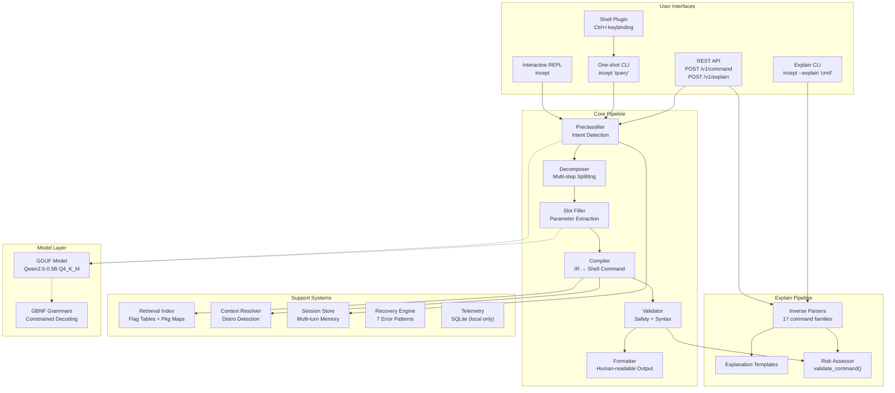

## Core Pipeline Flow

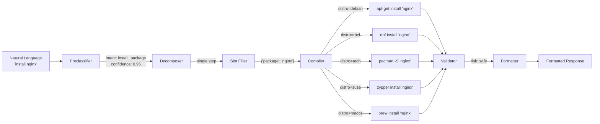

## Explain Pipeline (Reverse Flow)

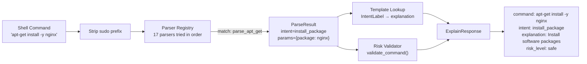

## Server Middleware Stack

Middleware is applied outermost-first. The request passes through each layer inward; the response passes back outward.

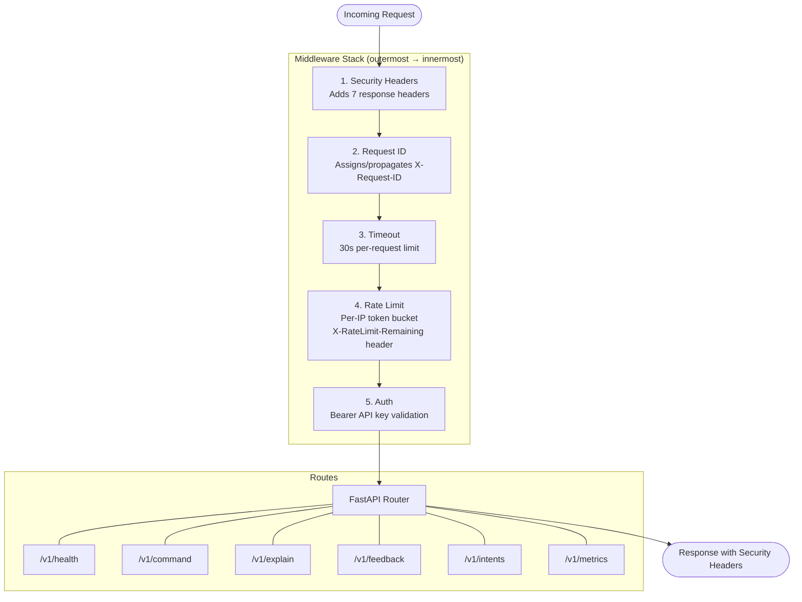

## Distro Family Architecture

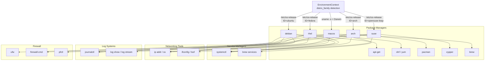

## Safety & Risk Classification

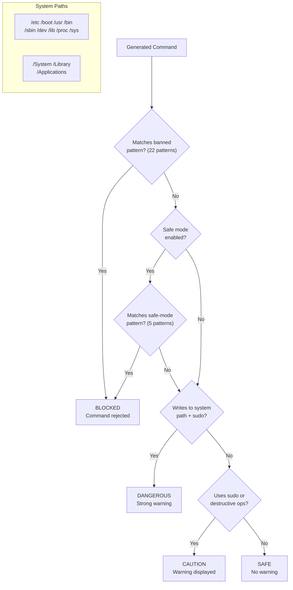

## Error Recovery Loop

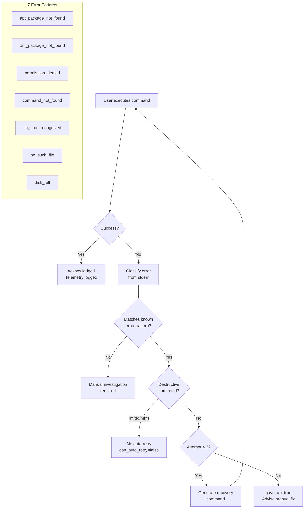

## Session & Multi-Turn Flow

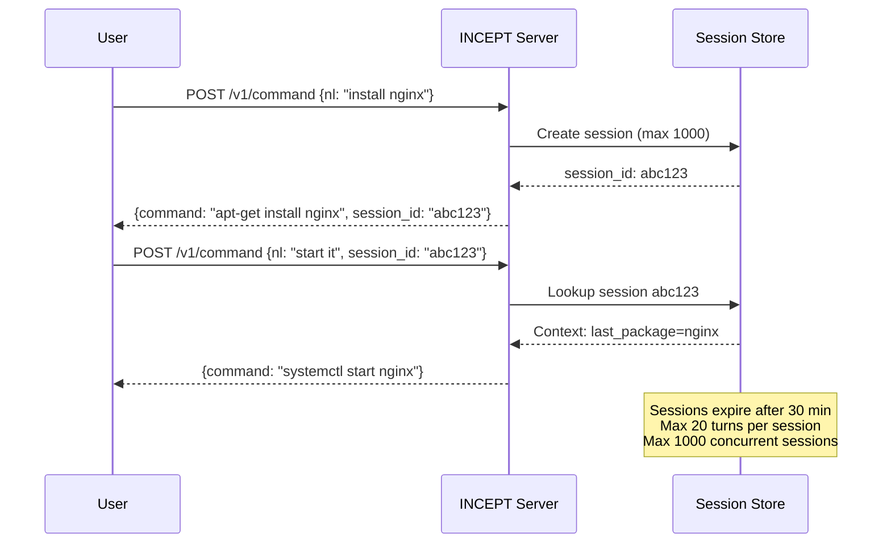

## CLI Modes

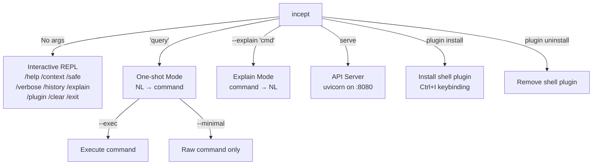

## Shell Plugin Architecture

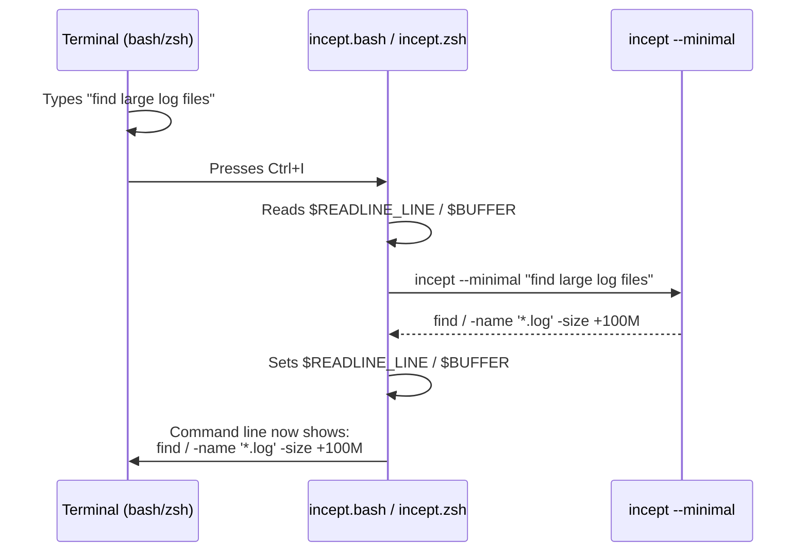
